# C4 Model Diagrams
## Auto-Healing AI DevOps Platform

---

## Structural Diagrams

### 1. Level 1 — System Context

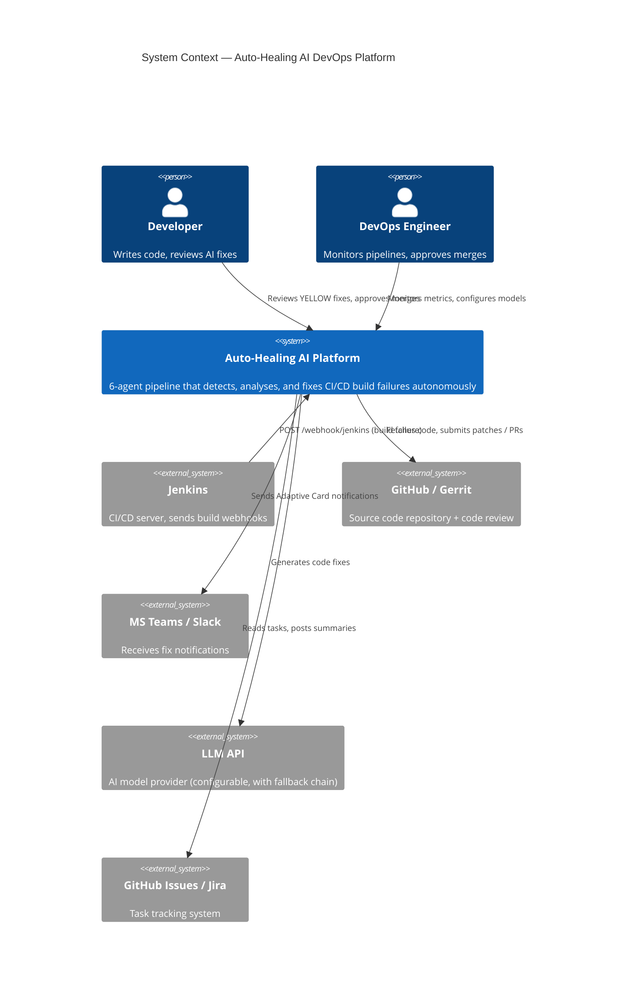

---

### 2. Level 2 — Container View (6-Agent Pipeline)

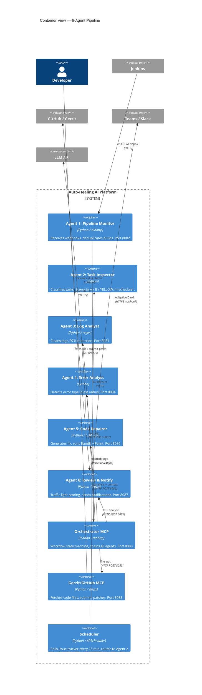

---

### 3. Level 3 — Orchestrator Components

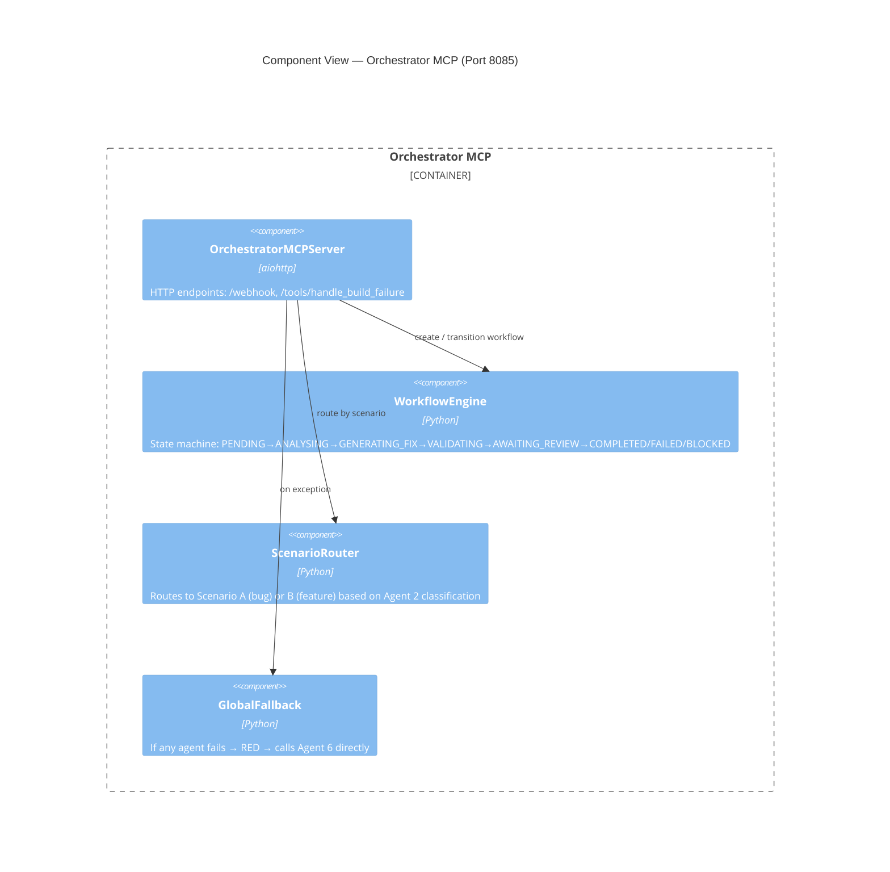

---

### 4. Level 3 — Log Analyst Components (Agent 3)

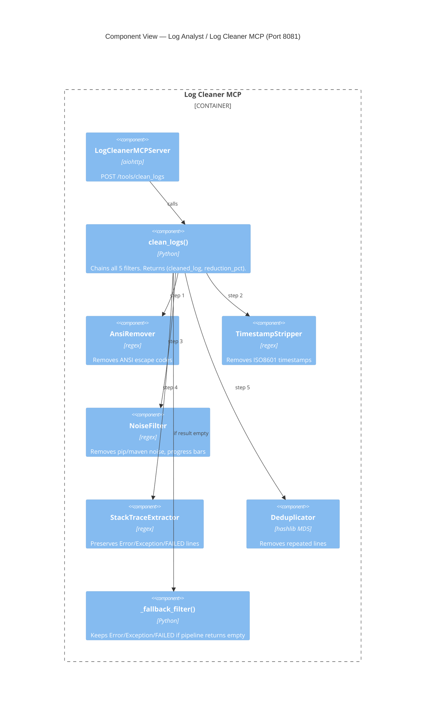

---

## Flow Diagrams

### 5. Main Workflow Flowchart

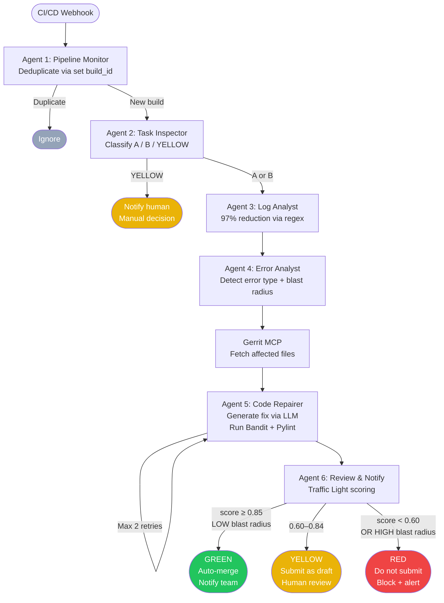

---

### 6. Traffic Light Decision Tree

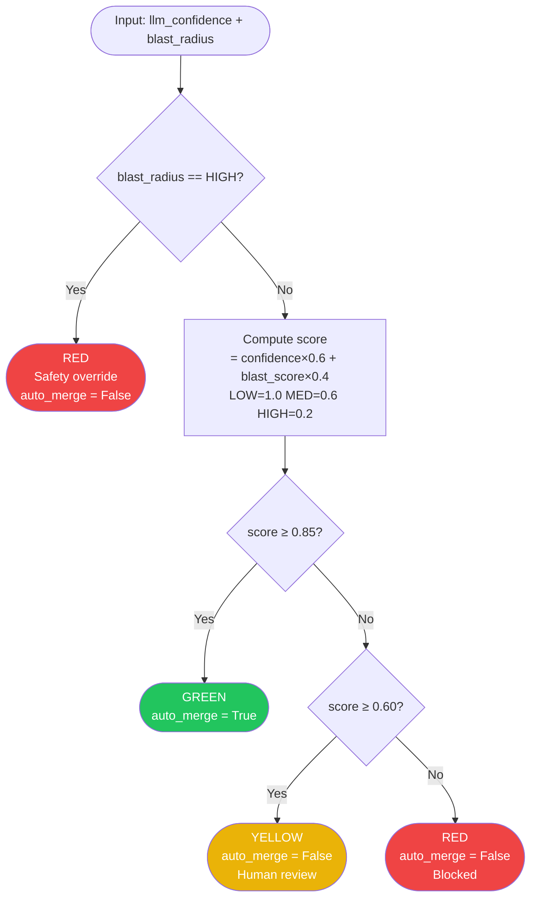

---

### 7. Log Analyst Filter Pipeline

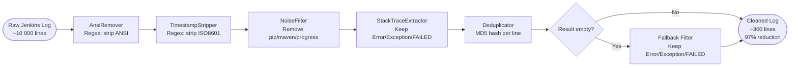

---

## Sequence Diagrams

### 8. Scenario A — Happy Path (GREEN)

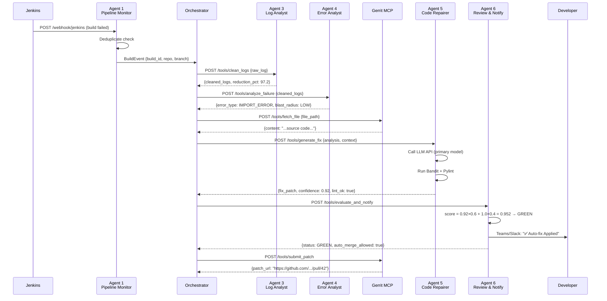

---

### 9. YELLOW Path (Human Review Required)

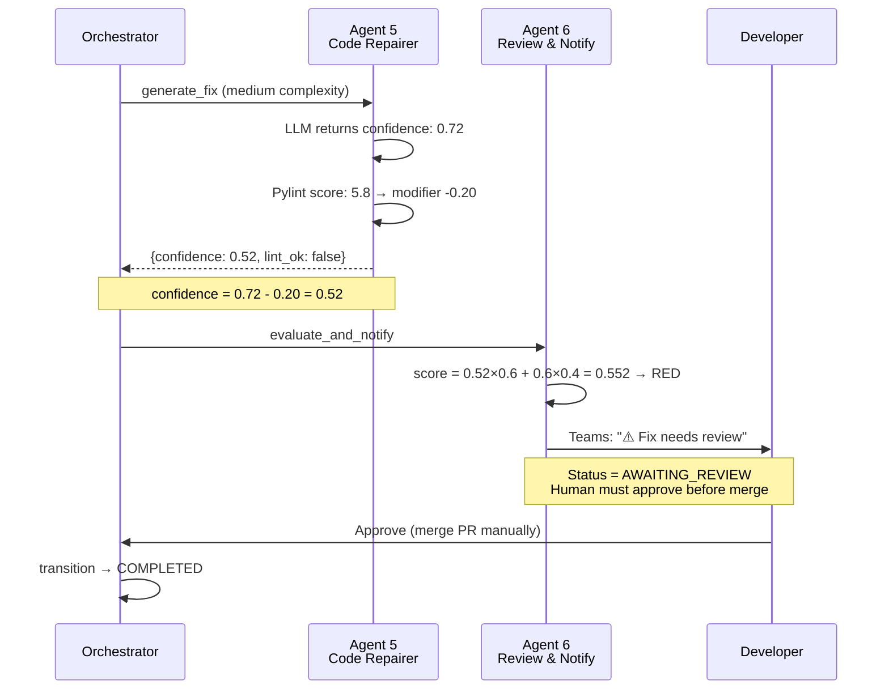

---

### 10. Failure Recovery — Global Fallback

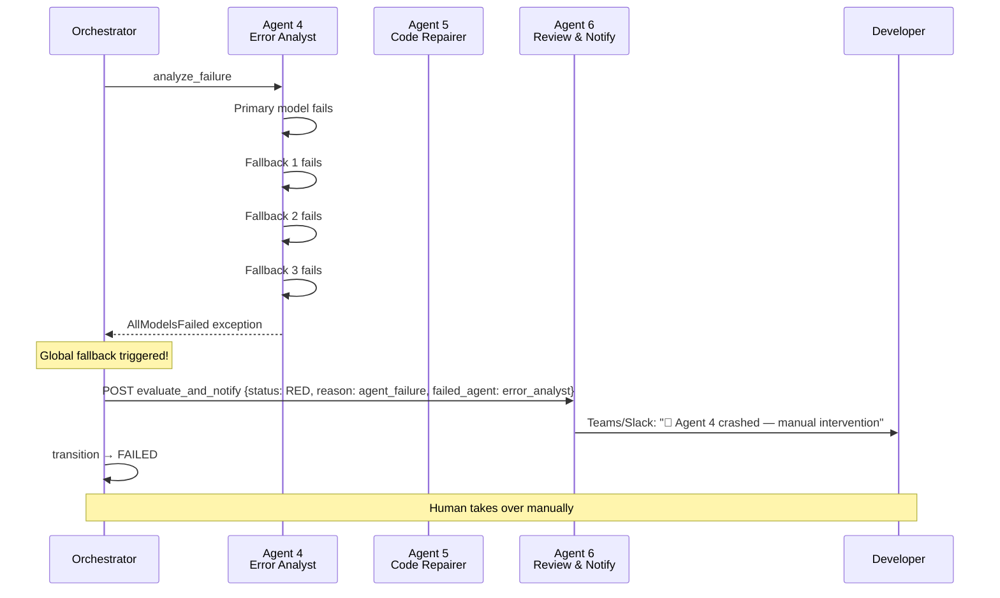

---

## Deployment Diagrams

### 11. Docker Compose Deployment (PoC)

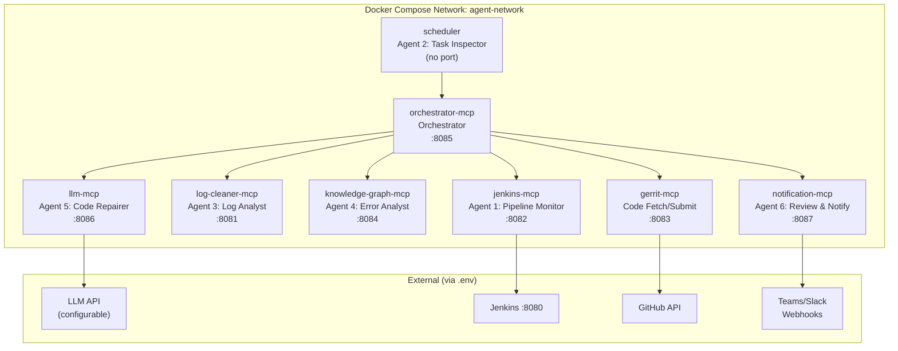

---

### 12. Network Topology

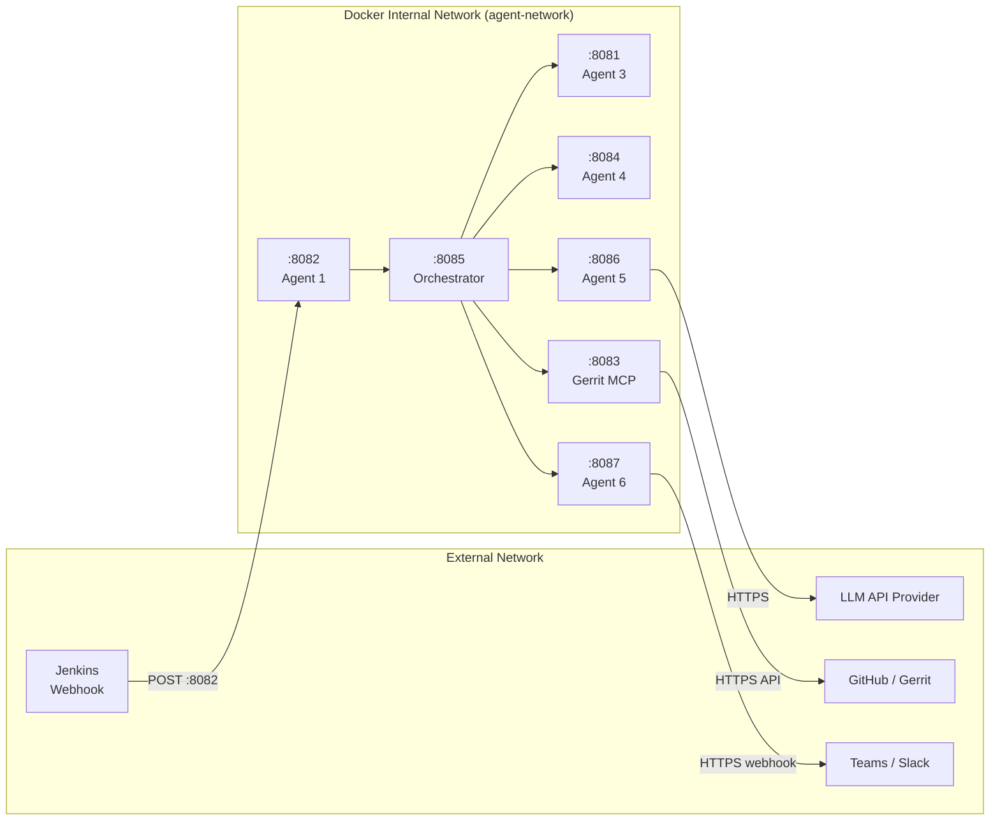

---

## Other Diagrams

### 13. Domain Model — Class Diagram

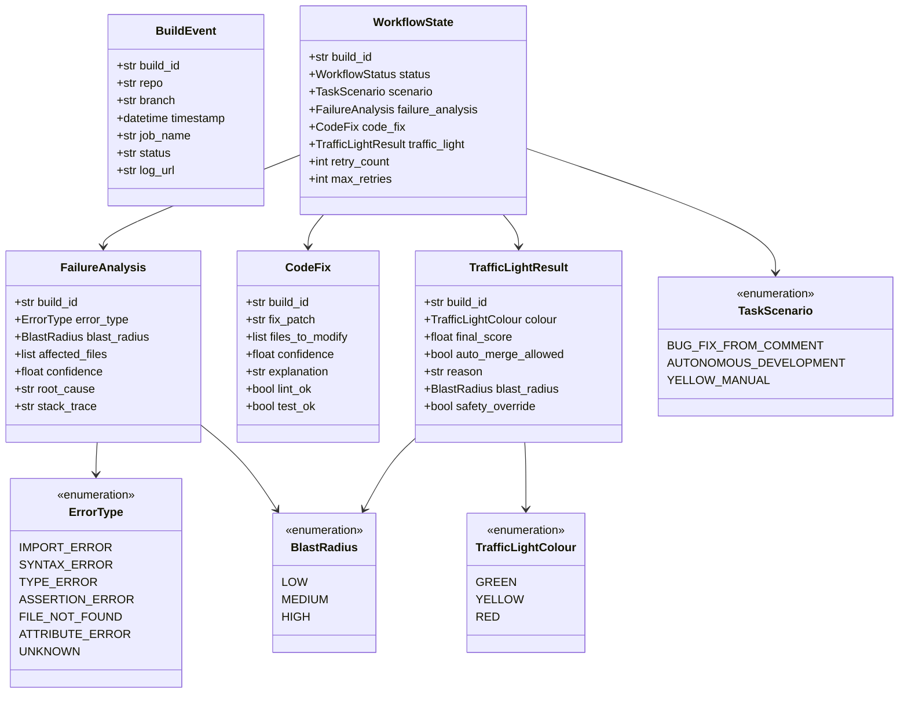

---

### 14. Model Fallback Chain

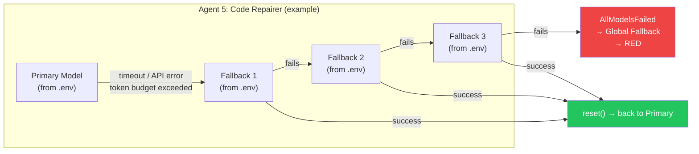

---

### 15. Token Budget Flow

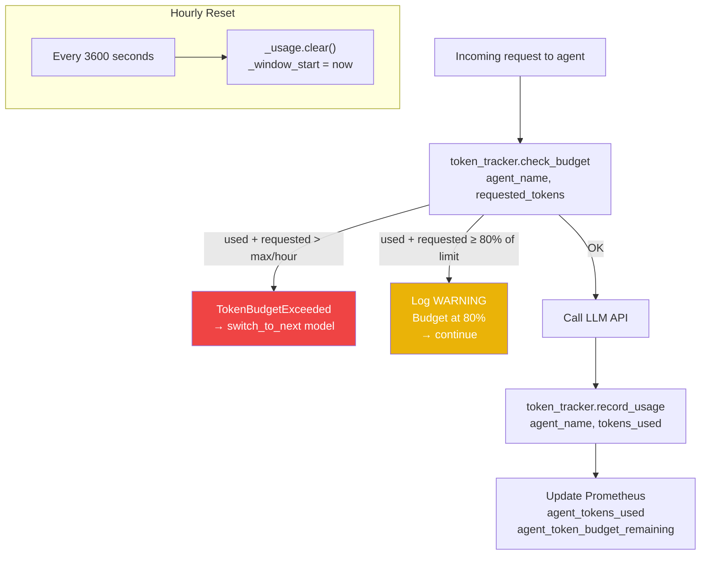
